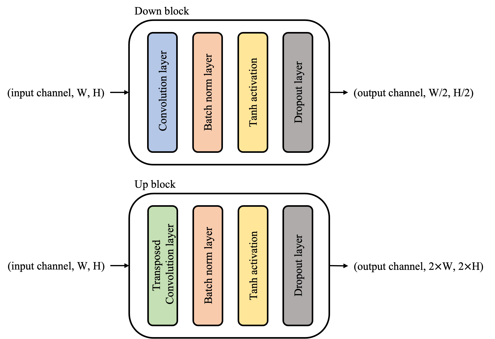
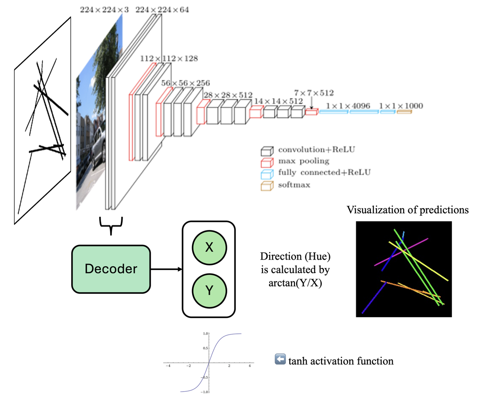
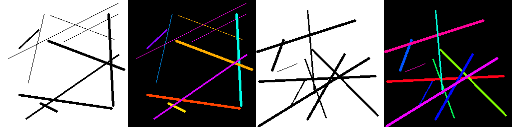
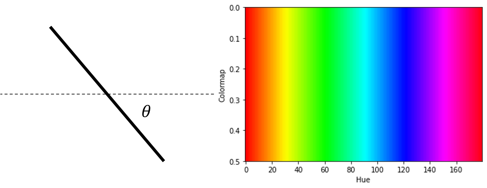

# Study of the effect of visual illusions on deep neural networks

## Why Study?
- Provides a special insight into the working mechanisms of the human visual systems and brain.
- Aiming for neural network models to replicate visual illusions better can potentially improve their performance (Alexander 2021)

<!-- make image smaller and in center -->

### The figure above is called Zöllner illusion
- Parallel lines are superimposed by oblique lines.
- The oblique lines are not parallel, but appear to be due to the effect of the parallel lines.

## Experiment Setup
### Goal
- To find the effect of Zöllner illusion on DNNs.
- Compare with human visual system.

### Approach to train DNNs
- Predict the direction of the lines at each pixel.
- Direction is give by vector $(x, y)$
- Input shape: $3\times W\times H$
- Output shape: $2\times W\times H$

## Selected DNNs architectures
### Unet

### Pre-trained VGG16 with decoder

### Transformer based DNN
#### Encoder
- 3 CNNs
#### Transformer
#### Decoder
- 3 CNNs
- $tanh$ activation layer

## Training Dataset

### Input
- 10 random lines without anti-aliasing
- Thickness ranges from 1 to 3 pixels
- Shape: $3\times W\times H$

### Label
- $(x,y)$ for each pixel, range from $[-1, 1]$
- Shape: $2\times W\times H$

