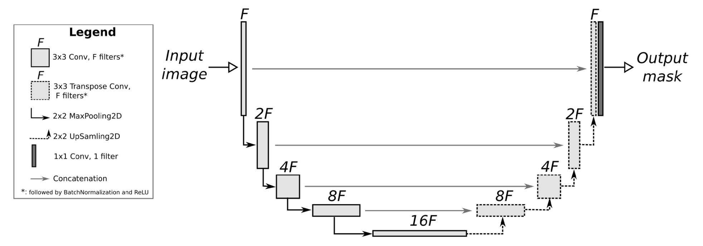
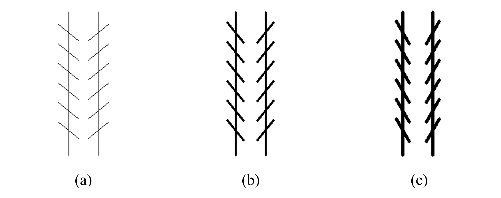

# Study of the effect of visual illusions on deep neural networks

## Why Study?
- Provides a special insight into the working mechanisms of the human visual systems and brain.
- Aiming for neural network models to replicate visual illusions better can potentially improve their performance (Alexander 2021)

<!-- make image smaller and in center -->

### The figure above is called Zöllner illusion
- Parallel lines are superimposed by oblique lines.
- The oblique lines are not parallel, but appear to be due to the effect of the parallel lines.

## Experiment Setup
### Goal
- To find the effect of Zöllner illusion on DNNs.
- Compare with human visual system.

### Approach to train DNNs
- Predict the direction of the lines at each pixel.
- Direction is give by vector $(x, y)$
- Input shape: $3\times W\times H$
- Output shape: $2\times W\times H$

## Selected DNNs architectures
### Unet

### Pre-trained VGG16 with decoder

### Transformer based DNN
#### Encoder
- 3 CNNs
#### Transformer
#### Decoder
- 3 CNNs
- $tanh$ activation layer

## Training Dataset

### Input
- 10 random lines without anti-aliasing
- Thickness ranges from 1 to 3 pixels
- Shape: $3\times W\times H$

### Label
- $(x,y)$ for each pixel, range from $[-1, 1]$
- Shape: $2\times W\times H$

## Testing Dataset

- line thickness ranges from 1 to 3 pixels
- slash direction ranges from 0 to 80 degrees

## Results
### Traning result overview
- Loss criterion
  - Mean square error (MSE)
<!-- table -->
| Model | Test loss |
| :---: | :---: |
| Unet 64 | 427 |
| Unet 32 | 441 |
| Unet 16 | 635 |
| Unet 8  | 840 |
| VGG16   | 893 |
| Transformer | 525 |

From the result, we are able to tell that some DNNs is fooled by Zollner illusions just like human.

## Similarities between DNN and human visual system

- Unet 64
  - Perceive line segment tilting not uniformly but between slashes
- Sample outputs in HSV color representations
  - Aqua (90 degrees in hue value); Blue (over 90 degrees on the left line)
- The results are consistent with the previous theory by Chiang

## Potential theory behind Zollner illusion
- Accurding to Chiang
  - Due to light diffraction
  - As two objects are closer, they merge into one maximum intensity

## Difference between DNN and human visual system

- Human visual systems
  - Influence is strongest when the slash angle is 60 to 70 degrees
- DNNs
  - U-net 64 and 32
    - Inflence get stronger as the slash angle keep increasing
  - Transformer
    - Does not show consistency with human perception, even with high accuracy